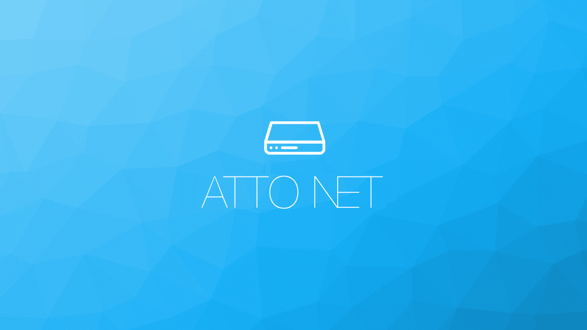
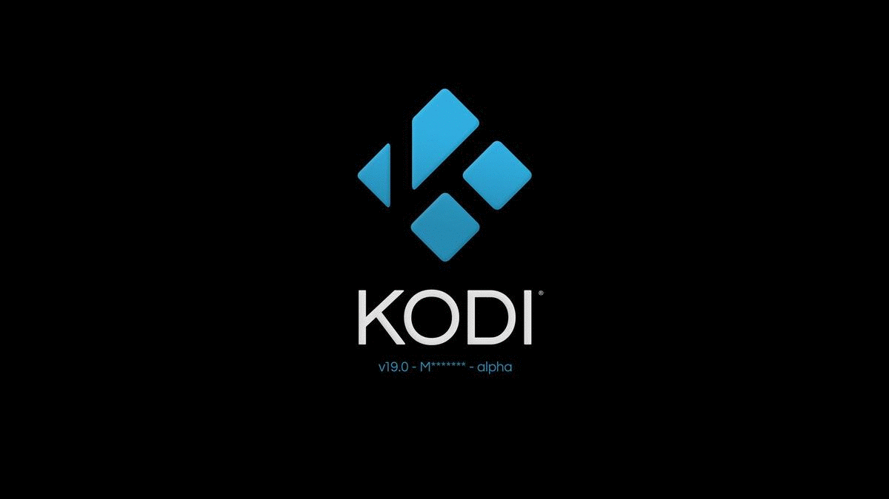
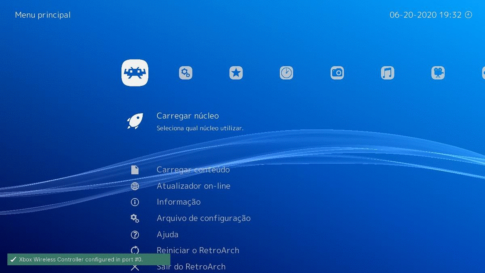
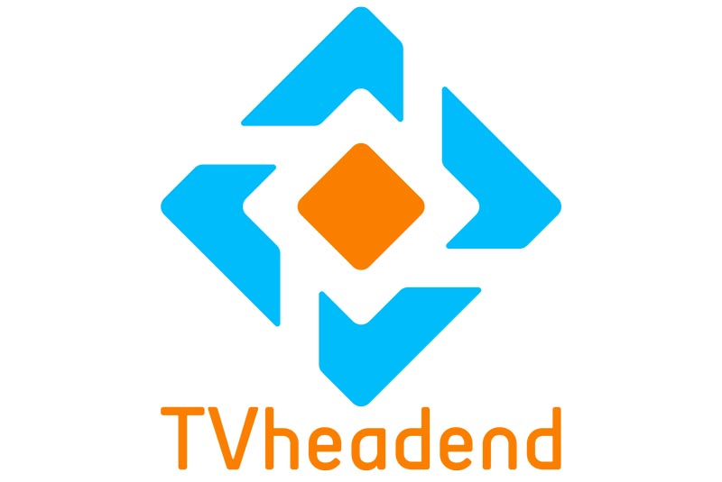

<p align="center">
 
</p>

<h3 align="center" style="color:blue;">Atto Pixel</h3>

---
## :pencil: Índice
- [**Sobre o Projeto**](#sobre_o_projeto)
- [**Ficha Técnica**](#ficha_tecnica)
- [**Instalação**](#instalacao)
- [**Sobre o Enigma2**](#sobre_o_enigma2)
- [**Sobre o Kodi**](#sobre_o_kodi)
- [**Sobre o RetroArch**](#sobre_o_retroarch)
- [**Sobre o TVheadend**](#sobre_o_tvheadend)

---
## :eyeglasses: Sobre o Projeto <a name="sobre_o_projeto"></a>

Muitos me perguntam o porque de fazer um projeto híbrido ao invés de partir para projetos já em desenvolvimento como por exemplo **OE Alliance (Enigma2)**, **CoreELEC (KODI)**, **LibreELEC (KODI)** entre outros. E o motivo é simples, esses projetos usam um Sistema Operacional apenas com o essencial para rodar o aplicativo que será utilizado como frontend (**Engima2 / KODI**). Eu não quero ficar preso a um aplicativo especifico ou muito menos ter que precisar utilizar imagens diferentes para poder usar outro aplicativo, então por isso gerei uma base completa com o Sistema Operacional **Debian 10 (ARMHF)** com suporte total a desenvolvimento ou seja você tem a plena oportunidade de fazer oque quiser sem precisar de múltiplas imagens. **(virou praticamente um PC ;P)**

No momento deixei o **Enigma2** como aplicativo principal, mais nada impede de trocá-lo pelo **KODI** ou **RetroArch** por exemplo.

---
## :notebook: Ficha Técnica <a name="ficha_tecnica"></a>

- Processador: **Hi3716Cv200**
- 1ª Geração: **2GB** RAM - **4GB** NAND - Tuner **DVB-C Triple**
- 2ª Geração: **2GB** RAM - **8GB** NAND - Tuner **DVB-C Triple** + Tuner **DVB-S/S2** ou **ISDB-T**
- Rede: **10MB / 100MB / 1000MB** - WiFi **2GHz** + **Bluetooth**

---
## :checkered_flag: Instalação <a name="instalacao"></a>

1. Baixe **todos** os arquivos relacionados a **Última Versão** e lembre-se de checar o arquivo de **ChangeLog.md** caso exista.
 - **Última Versão:** [**19/06/2020**](https://leandro.azsat.org/2020-06-19/)
 - **Todas as Versões:** [**Site**](https://leandro.azsat.org/)
2. **Caso exista** o arquivo <span style="color:red">**e2d-armhf-pixel.upk**</span> na pasta da **Última Versão** é obrigatório aplicá-lo no sistema, pois ele trás alterações importantes para o correto funcionamento do mesmo.
 - Se o arquivo <span style="color:red">**não existir**</span> é obrigatório estar com o arquivo aplicado <span style="color:red">**e2d-armhf-pixel.upk**</span> da **Última Versão** em que ele tenha sido liberado.
 - Você pode aplicar o arquivo <span style="color:red">**e2d-armhf-pixel.upk**</span> ao sistema através do <span style="color:red">**Android** </span> ou pelo modo de <span style="color:red">**Recovery**</span>.
3. Utilizando o <span style="color:red">**WinRAR**</span> descompacte o arquivo que **começa** com o nome <span style="color:red">**e2d-armhf-pixel.img.tar**</span>, após descompactá-lo você deverá ter o arquivo <span style="color:red">**e2d-armhf-pixel.img**</span> ou no caso de **versões posteriores** a data **19/06/2020** você terá os arquivos <span  style="color:red">**e2d-armhf-pixel.img, update.img e update.upk**</span>.
 - Segue duas formas de se aplicar o arquivo <span style="color:red">**e2d-armhf-pixel.img**</span> no <span style="color:red">**SDCard**</span>.
 - <span style="color:red">**1ª:**</span> Você pode aplicar o arquivo <span style="color:red">**e2d-armhf-pixel.img**</span> utilizando o [Win32DiskImager](https://sourceforge.net/projects/win32diskimager/) ou usando o comando [dd](https://www.howtoforge.com/linux-dd-command/) no linux.<pre><code>dd if=/media/sda1/e2d-armhf-pixel.img of=/dev/mmcblk1</code></pre>
 - <span style="color:red">**2ª:**</span> Formate um <span style="color:red">**Pen Drive** em **FAT32**</span> e copie os arquivos <span  style="color:red">**e2d-armhf-pixel.img, update.img e update.upk** </span> para o ROOT do <span style="color:red">**Pen Drive**</span>.
 - Desligue o aparelho e plug o <span style="color:red">**Pen Drive**</span>.
 - Ligue o aparelho e ao aparecer <span style="color:red">**MENU**</span> escrito no visor, aperte a teclar <span style="color:green">**VERDE** </span> do controle remoto, com isso o visor deverá mudar de <span style="color:red">**MENU**</span> para <span style="color:red">**UPDT** </span> e iniciará o processo de atualização do <span style="color:red">**SDCard**</span>.
 - <span style="color:red">**AVISO:**</span> Além de demorado, este método só funcionará em **versões posteriores** a data **19/06/2020** do arquivo <span style="color:red">**e2d-armhf-pixel.upk**</span>.
4. Após concluir o procedimento no <span style="color:red">**SDCard**</span>, deslique o aparelho e ponha o <span style="color:red">**SDCard**</span> caso o tenha removido.
5. Ao ligar o aparelho irá aparecer <span style="color:red">**MENU**</span> no visor, você terá alguns segundos para apertar uma tecla do controle remoto e escolher uma das opções abaixo, caso contrário será iniciada a última opção escolhida:
    - Tecla <span style="color:red">**VERMELHA**</span> - Android
    - Tecla <span style="color:green">**VERDE**</span> - Update (**versões posteriores** a data **19/06/2020**)
    - Tecla <span style="color:blue">**AZUL**</span> - Enigma2
6. A escolha ficará como padrão, então não precisa ficar escolhendo a cada desligamento ou reboot do sistema porém pode ser mudada sempre que aparecer <span style="color:red">**MENU**</span> ao ligar o aparelho.

---
### :star: Sobre o Enigma2 <a name="sobre_o_enigma2"></a>


Você pode **assistir TV**, **gravar** e **fazer streaming** ao mesmo tempo sem nenhum problema. O suporte aos tuners está **100%** e o seu desempenho está muito melhor que no Android ou em outras distribuições [**Enigma2**](#enigma2) que utilização o mesmo processador.

**Amostra de Gravação**

[](https://www.youtube.com/watch?v=xuvxgbMNHiA)

**Amostra de Streaming**

[](https://www.youtube.com/watch?v=G5D4BXstDdw)

Foi adicionado os plugins para abrir o [**Kodi**](#kodi) e o [**RetroArch**](#retroarch).

Caso encontre algum **bug**, você pode **reportá-lo** no **git** do projeto ou se você for um **desenvolvedor** ou mesmo um **entusiasta** você pode **baixar o código** e **compilar/debugar** no próprio **receptor**.

- Versão: **6.4**
- Source: [**GitLab**](https://gitlab.com/leandrotsampa/enigma2/-/tree/6.4-AVServer)

---
### :star: Sobre o Kodi <a name="sobre_o_kodi"></a>


Foi implementado a **Decodificação de Video por HW** e aplicado as devidas correções para o funcionamento pleno do aplicativo, você pode assistir seus videos em **4K** sem nenhum problema **;P**. Você pode executá-lo pela lista de **plugins** do [**Enigma2**](#enigma2).

Caso encontre algum **bug**, você pode **reportá-lo** no **git** do projeto ou se você for um **desenvolvedor** ou mesmo um **entusiasta** você pode **baixar o código** e **compilar/debugar** no próprio **receptor**.

Caso queira colocar o [**Kodi**](#kodi) como aplicativo principal, basta executar os comandos abaixo no terminal **SSH**:

<span style="color:red">**AVISO:**</span> Apesar de funcional, ainda é experimental.

```shell
# Desativar o Enigma2
systemctl disable enigma2

# Ativar o Kodi
systemctl enable kodi

# Ativar o TVheadend (Opcional)
systemctl enable tvheadend

# Reiniciar o Aparelho
shutdown -r now
```


- Versão: **19-alpha**
- Source: [**GitLab**](https://gitlab.com/leandrotsampa/xbmc/-/tree/Enigma2-Leia)

---
### :star: Sobre o RetroArch <a name="sobre_o_retroarch"></a>


É um ótimo emulador de jogos, não foi preciso muitas alterações para adiciona-lo nesta lista. Você pode executá-lo pela lista de **plugins** do [**Enigma2**](#enigma2).

Caso você seja um **desenvolvedor** ou mesmo um **entusiasta** você pode **baixar o patch** e **compilar/debugar** no próprio **receptor**.

- Versão: **1.8.5**
- Patch: [**GitHub**](https://gist.github.com/leandrotsampa/48ccad44ec138afa5da7460703366ae2)

---
### :star: Sobre o TVheadend <a name="sobre_o_tvheadend"></a>


É um ótimo software de uso profissional voltado para **streaming**, por padrão ele vem desativado já que o [**Enigma2**](#enigma2) vem com suporte a **streaming** porém para facilitar a vida de alguns usuários já deixei o programa instalado.

Caso queira ativar o [**TVheadend**](#tvheadend), basta executar os comandos abaixo no terminal **SSH**:

<span style="color:red">**AVISO:**</span> O [**Enigma2**](#enigma2) e o [**TVheadend**](#tvheadend) não podem utilizar os mesmos **tuners**, por isso tenha isso em mente ao configurar o uso de cada **tuner** caso vá **utilizar ambos** os programas.

```shell
# Ativar o TVheadend
systemctl enable tvheadend

# Reiniciar o Aparelho
shutdown -r now
```

- Versão: **4.3-1857~g221c29b40-dirty**
- Patch: [**GitHub**](https://github.com/tvheadend/tvheadend)
